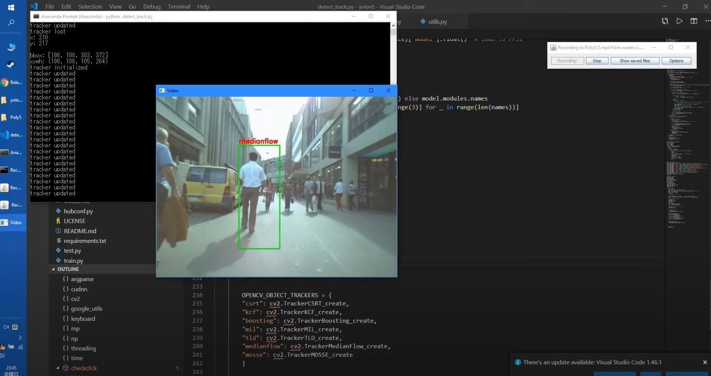

#yolov5-opencv-detect-track

A yolov5 based application, it uses the prediction results by yolov5 to activate the selected opencv built-in tracking algorithm.

How to use:
1. install dependencies
2. python detect_track.py

<a href="https://www.youtube.com/watch?v=2VQd6gOp5dQ">Demo</a>
